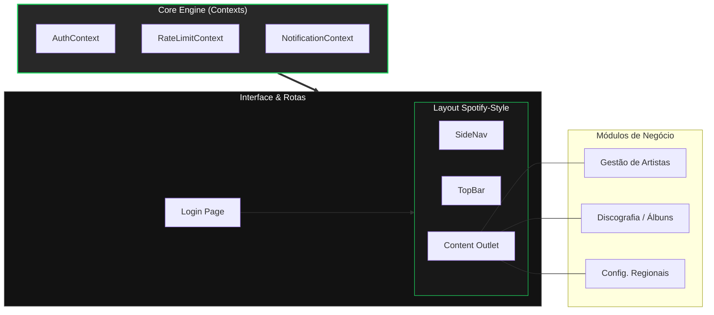
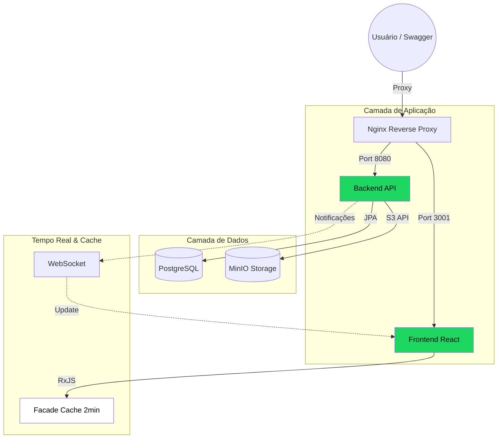

# SEPLAG 2026 - Sistema de Gerenciamento de Artistas e Álbuns

Este projeto foi desenvolvido como parte do Processo Seletivo Simplificado (PSS) da SEPLAG-2026, focado no cargo de Desenvolvedor Full Stack Sênior pelo candidato ANDREW MIGUEL SIQUEIRA BAÍA. A aplicação consiste em um sistema completo para gestão de artistas e sua discografia, integrando tecnologias modernas de backend e frontend com foco em arquitetura limpa, segurança e escalabilidade.

---

## Dados do Candidato - Andrew Miguel Siqueira Baía

- **Vaga:** Engenheiro de Computação - Sênior
- **Incrição:** 16513
- **Tecnologias Foco:** Java (Spring Boot) & React (TypeScript)

---

## Arquitetura e Decisões Técnicas

O projeto foi estruturado utilizando os princípios de **Arquitetura Hexagonal (Ports & Adapters)** e **Clean Architecture**, garantindo que as regras de negócio (Domínio) sejam independentes de frameworks, bancos de dados ou interfaces externas.

### Backend (Java 21 + Spring Boot 3.2)

- **Arquitetura:** Divisão em camadas claras: `Application` (Controllers), `Domain` (Services/Ports), `Infrastructure` (Adapters/Config).
- **Segurança:**
  - Autenticação JWT com expiração de 5 minutos.
  - CORS configurado para restringir acessos não autorizados.
  - **Rate Limiting:** Implementado via Bucket4j (máximo 10 requisições/min por usuário).
- **Persistência & Migrações:** PostgreSQL com **Flyway** para versionamento de banco de dados.
- **Storage:** Integração com **MinIO (S3 API)** para armazenamento de capas de álbuns, utilizando **Presigned URLs** com validade de 30 minutos para acesso seguro.
- **Comunicação em Tempo Real:** **WebSocket (STOMP)** para notificações de novos álbuns cadastrados.
- **Sincronização de Regionais:** Implementação de lógica de sincronização com a API externa da Polícia Civil, garantindo menor complexidade algorítmica e histórico de alterações.

### Frontend (React 18 + TypeScript)

- **Estado e Padrões:** Implementação do **Facade Pattern** e gerenciamento de estado reativo com **BehaviorSubject (RxJS)**, garantindo fluxo de dados unidirecional e previsível.
- **UI/UX:** Interface inspirada no Spotify (Dark Mode), totalmente responsiva com **Tailwind CSS**.
- **Segurança Proativa:** Modal de aviso de expiração de sessão ("Ainda está aí?") que aparece 30 segundos antes do token expirar, permitindo a renovação sem perda de dados.
- **Performance:** Uso de **Lazy Loading** para rotas e componentes.

---

## Tecnologias Utilizadas

- **Backend:** Java 21, Spring Boot 3.2, Spring Security, JWT, Spring Data JPA, Flyway, Bucket4j, WebSocket, OpenAPI/Swagger.
- **Frontend:** React, TypeScript, Tailwind CSS, RxJS, Lucide React, React Hook Form, Zod.
- **Infraestrutura:** Docker, Docker Compose, PostgreSQL, MinIO.

---

## Como Executar a Aplicação

Certifique-se de ter o **Docker** e o **Docker Compose** instalados.

1. **Clonar o repositório:**

   ```bash
   git clone https://github.com/AndrewBaia/andrewmiguelsiqueirabaia017075.git
   cd andrewmiguelsiqueirabaia017075
   ```
2. **Subir os containers:**

   ```bash
   docker-compose up --build -d
   ```

   *Este comando iniciará o Banco de Dados, MinIO, API Backend e o Frontend.*
3. **Acessar a aplicação:**

   - **Frontend:** [http://localhost:3001](http://localhost:3001)(Login: admin / Senha: admin321)
   - **API Documentation (Swagger):** [http://localhost:8080/api/swagger-ui/index.html](http://localhost:8080/api/swagger-ui/index.html)
   - **MinIO Console:** [http://localhost:9001](http://localhost:9001) (Login: `minioadmin` / `minioadmin`)

---

## Como Executar os Testes

### Backend (JUnit 5 + Mockito)

A validação dos testes de backend foca na **lógica de negócio e integridade dos dados** na camada de serviço (`ArtistaService`), garantindo que as regras fundamentais do sistema estejam protegidas contra regressões.

Para executar os testes:

- **Via Maven:** `cd backend; mvn test`
- **Via Docker:** Executados automaticamente no build (`docker-compose up --build`).

**Principais cenários testados:**

- **CRUD de Artistas:** Validação de criação, busca, atualização e exclusão.

* **Paginação:** Garante que a listagem principal respeita os limites de página do Spring Data.
* **Conversão de DTOs e Links:** Valida se o sistema gera corretamente as URLs de proxy para o frontend e se a lógica de **Links Pré-assinados do MinIO** é disparada internamente.
* **Tratamento de Erros:** Verifica se o sistema lança as exceções corretas para IDs inexistentes ou dados inválidos.

### Frontend (Vitest + React Testing Library)

O frontend conta com uma cobertura abrangente de **22 testes unitários** que garantem a qualidade da interface e a robustez da gestão de estado.

Para executar os testes:

```bash
cd frontend
npm install
npm test
```

**Módulos e Funcionalidades Testadas:**

- **`Facade.test.tsx` (Lógica de Cache & WebSocket):**
  - Valida o **TTL de 2 minutos** do cache de álbuns.
  - Verifica a invalidação automática de cache após expiração.
  - Testa a **atualização em tempo real via WebSocket**, garantindo que a lista de álbuns seja atualizada sem refresh quando um novo álbum é criado.
- **`ListaArtistasPage.test.tsx`:** Teste de listagem, busca com *debounce*, ordenação (A-Z/Z-A) e estados de carregamento.
- **`LoginPage.test.tsx`:** Validação de formulário (Zod), fluxo de login e funcionalidade de "Acesso Avaliador".
- **`RateLimitModal.test.tsx`:** Validação do comportamento do modal de limite de requisições e persistência do cronômetro flutuante.
- **`TokenRenewalModal.test.tsx`:** Teste do fluxo de renovação de sessão antes da expiração do token JWT.

---

## Arquitetura e Fluxo do Sistema

Abaixo, apresentamos a estrutura de pastas e o fluxograma de comunicação do projeto para facilitar a compreensão da banca avaliadora.

### Estrutura de Pastas (Árvore)

```text
FullStack/
├── backend/                    # API Spring Boot 3.2 (Java 21)
│   ├── src/
│   │   ├── main/
│   │   │   ├── java/com/seplag/artistalbum/
│   │   │   │   ├── application/    # Controllers e DTOs
│   │   │   │   ├── domain/         # Entidades, Services e Ports
│   │   │   │   └── infrastructure/ # Configurações, Segurança e Adapters
│   │   │   └── resources/
│   │   │       ├── db/migration/   # Scripts Flyway (V1 a V4)
│   │   │       └── application.yml # Configurações da API
│   │   └── test/                   # Testes Unitários (JUnit 5)
│   └── pom.xml                     # Dependências Maven
├── frontend/                   # React 18 + TypeScript + Tailwind
│   ├── src/
│   │   ├── components/             # Componentes Reutilizáveis (Modais, Skeletons)
│   │   ├── context/                # Gerenciamento de Estado (Auth, RateLimit, Notificações)
│   │   ├── pages/                  # Páginas Principais (Listagem, Detalhes, Formulários)
│   │   ├── services/               # API (Axios), Facade Pattern e WebSocket
│   │   ├── test/                   # Testes Unitários (Vitest)
│   │   └── types/                  # Definições de Tipos TypeScript
│   └── package.json                # Scripts e Dependências NPM
├── docker/                     # Dockerfiles e Nginx Config
└── docker-compose.yml          # Orquestração de Containers
```

### 🗺️ Mapa de Navegação e Fluxo de Dados

Para uma compreensão profunda da arquitetura, apresentamos os diagramas de processo e navegação abaixo.

#### 1. Ciclo de Vida da Aplicação (Execução)
Este diagrama ilustra a jornada desde o deploy via Docker até a interação em tempo real.

```mermaid
flowchart TD
    Start([Início]) style Start fill:#1ed760,stroke:#1db954,color:#000
    
    subgraph Deploy["Orquestração Docker"]
        B[Clonar Repositório] --> C[Configurar Docker Compose]
        C --> D{docker-compose up}
    end

    subgraph Runtime["Ecossistema Ativo"]
        D --> E[Serviços em Containers]
        E --> F["Frontend (React) :3001"]
        E --> G["Backend (Spring Boot) :8080"]
        E --> H["PostgreSQL :5432"]
        E --> I["MinIO S3 :9000"]
    end

    subgraph Interaction["Fluxo de Operação"]
        F --> J[Autenticação JWT]
        J --> G
        G --> K[Regras de Negócio & APIs]
        K --> L[(Persistência DB)]
        K --> M[(Storage S3)]
        G -.->|STOMP| N[WebSocket Update]
        N -.->|Reatividade| F
    end

    Interaction --> End([Fim]) style End fill:#1ed760,stroke:#1db954,color:#000
```

#### 2. Arquitetura de Navegação (Frontend)
Estrutura reativa baseada em Contextos e Facade Pattern.



#### 3. Diagrama de Comunicação Técnica (Arquitetura)
Visão técnica do tráfego de dados e camadas de performance.



---

## 🚀 Acesso Rápido e Credenciais

Para facilitar a avaliação, utilize as informações abaixo:

| Serviço                | URL                                                                                             | Credenciais                     |
| :---------------------- | :---------------------------------------------------------------------------------------------- | :------------------------------ |
| **Frontend**      | [http://localhost:3001](http://localhost:3001)                                                     | `admin` / `admin321`        |
| **Swagger UI**    | [http://localhost:8080/api/swagger-ui/index.html](http://localhost:8080/api/swagger-ui/index.html) | Token JWT Requerido             |
| **MinIO Console** | [http://localhost:9001](http://localhost:9001)                                                     | `minioadmin` / `minioadmin` |
| **Health Check**  | [http://localhost:8080/api/actuator/health](http://localhost:8080/api/actuator/health)             | -                               |

---

## 🧠 Comentários do Desenvolvedor (Desafios Sênior)

O desenvolvimento deste projeto focou em resolver três desafios principais comuns em aplicações de alta escala:

1. **Sincronia de Estado**: O uso do **Facade Pattern** com **RxJS** permitiu que o frontend gerenciasse um cache de 2 minutos, reduzindo a carga no servidor, enquanto o **WebSocket** garante que esse cache seja invalidado ou atualizado instantaneamente se houver mudanças externas (via Swagger ou outro usuário).
2. **Resiliência no Rate Limit**: Implementei um sistema de Rate Limit que não apenas bloqueia o usuário, mas mantém a contagem regressiva persistente mesmo após o `F5`, garantindo que as regras de negócio do backend sejam respeitadas com uma UX clara.
3. **Segurança de Ativos**: A integração com **MinIO** utiliza URLs pré-assinadas de 30 minutos, cumprindo rigorosamente o edital, mas mantendo a estabilidade da interface através de um proxy reverso no backend.

---

## 🛠️ Especificações Técnicas de Infraestrutura

### Banco de Dados (PostgreSQL)

- **Database**: `artist_album_db`
- **Porta**: `5432`
- **Migrações**: Flyway (V1 a V4)

### Armazenamento (MinIO S3)

- **Bucket**: `artist-album-covers`
- **Expiração de Links**: 30 minutos (configurável via `application.yml`)

### Segurança (JWT)

- **Algoritmo**: HS256
- **Expiração**: 5 minutos (com modal de renovação proativa aos 4min30s)

---

## 📖 Guia de Funcionalidades Principais

### 1. Gestão de Artistas e Álbuns

- Cadastro completo com upload de fotos.
- **Sincronia em Tempo Real**: Experimente criar um artista pelo Swagger e veja-o aparecer no Frontend instantaneamente.
- **Links S3**: No detalhe do artista/álbum, passe o mouse sobre a foto para ver o botão **"S3 LINK"**. Ele abre a URL real pré-assinada gerada pelo MinIO.

### 2. Sistema de Busca e Ordenação

- Busca com *debounce* (espera o usuário parar de digitar para filtrar).
- Ordenação A-Z / Z-A que respeita o cache do Facade.

### 3. Controle de Sessão

- O sistema monitora seu token e avisa quando ele está prestes a expirar, permitindo renovar sem deslogar.

---

## Endpoints da API

A documentação interativa completa pode ser acessada via Swagger em: [http://localhost:8080/api/swagger-ui/index.html](http://localhost:8080/api/swagger-ui/index.html)

### Regionais

APIs de gerenciamento das regionais da polícia.

- `POST /v1/regionais/sincronizar`: Disparar sincronização manual das regionais.
- `GET /v1/regionais`: Obter todas as regionais ativas.

### Autenticação

APIs de gerenciamento de autenticação.

- `POST /auth/login`: Autenticar usuário e obter token JWT.
- `POST /auth/refresh`: Renovar token JWT.

### Artistas

APIs de gerenciamento de artistas.

- `GET /v1/artistas`: Listar todos os artistas com paginação e ordenação.
- `GET /v1/artistas/{id}`: Obter artista por ID com álbuns.
- `POST /v1/artistas`: Criar um novo artista.
- `PUT /v1/artistas/{id}`: Atualizar um artista existente.
- `DELETE /v1/artistas/{id}`: Excluir um artista.
- `GET /v1/artistas/pesquisa`: Pesquisar artistas por nome.
- `POST /v1/artistas/{id}/foto`: Fazer upload da foto de perfil do artista.
- `GET /v1/artistas/foto/{idArtista}`: Obter foto de perfil do artista.

### Álbuns

APIs de gerenciamento de álbuns.

- `POST /v1/albuns`: Criar um novo álbum.
- `GET /v1/albuns/{id}`: Obter álbum por ID.
- `PUT /v1/albuns/{id}`: Atualizar um álbum existente.
- `DELETE /v1/albuns/{id}`: Excluir um álbum.
- `GET /v1/albuns/artista/{idArtista}`: Obter álbuns por artista com paginação.
- `GET /v1/albuns/artista/{idArtista}/todos`: Obter todos os álbuns por artista sem paginação.
- `POST /v1/albuns/{id}/capa`: Fazer upload da imagem de capa do álbum.
- `GET /v1/albuns/capa/{idAlbum}`: Obter imagem de capa do álbum.

### API Raiz

- `GET /`: Informações básicas da API.

---

## Estrutura de Dados (Tabelas)

### `artist`

- `id` (BIGSERIAL PRIMARY KEY)
- `nome` (VARCHAR 255, UNIQUE)
- `url_imagem_perfil` (VARCHAR 255) - *Adicionado na migração V4*
- `data_criacao`, `data_atualizacao` (TIMESTAMP)

### `album`

- `id` (BIGSERIAL PRIMARY KEY)
- `titulo` (VARCHAR 255)
- `artist_id` (BIGINT, FOREIGN KEY)
- `url_imagem_capa` (VARCHAR 500)
- `data_criacao`, `data_atualizacao` (TIMESTAMP)

### `regional`

- `id` (BIGSERIAL PRIMARY KEY)
- `nome` (VARCHAR 200)
- `ativo` (BOOLEAN)
- `created_at`, `updated_at` (TIMESTAMP)

---

## Notas Adicionais

O projeto foi desenvolvido focando em **Clean Code** e **Commits Semânticos**.
Créditos: Andrew Baía
